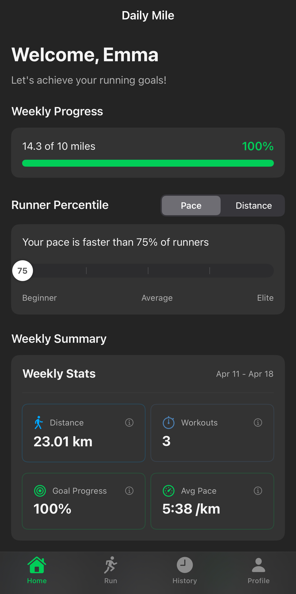

# The Daily Mile

A beautiful, feature-rich running tracker app built with SwiftUI. Track your runs, set weekly goals, view your progress, and enjoy a seamless running experience.

<div align="center">
  
</div>

## Features

- **Run Tracking**: Track your runs with GPS or use the demo mode for testing
- **Detailed Statistics**: View your pace, distance, duration, and calories burned
- **Weekly Goals**: Set and track progress towards your running goals
- **Weather Integration**: Check real-time weather conditions before your run
- **Workout History**: Browse through your past runs with detailed summaries
- **Customizable Profile**: Manage your personal information and preferences
- **Unit Preferences**: Choose between metric (km, kg) or imperial (miles, lbs) units
- **Dark Mode Support**: Use light, dark, or system theme modes (as shown in the screenshot)
- **Accessibility Features**: High contrast mode, larger text, and voice guidance options

## Requirements

- iOS 15.0 or later
- Xcode 13.0 or later
- Swift 5.5 or later
- An OpenWeatherMap API key (for weather functionality)

## Installation

1. Clone the repository:

```bash
git clone https://github.com/lucastimho/the-daily-mile.git
cd the-daily-mile
```

2. Set up your OpenWeatherMap API key:

   - Rename `DailyMile/DailyMile/Utilities/APIKeys.sample.swift` to `APIKeys.swift`
   - Replace `your_api_key_here` with your actual OpenWeatherMap API key
   - Note: The app will work without an API key by displaying simulated weather data

3. Open the project in Xcode:

```bash
open DailyMile/DailyMile.xcodeproj
```

4. Build and run the app (⌘+R)

## Usage

### Demo Mode

The app launches in demo mode by default, allowing you to explore all features with simulated data. Toggle this off in the Profile tab when you're ready to track real runs.

### Authentication

- Use the demo users (credentials shown on the login screen) or create your own account
- Your profile information and run history are saved locally

### Tracking a Run

1. Navigate to the Run tab
2. (Optional) Check the weather conditions by tapping "Show Weather"
3. Tap "START RUN" to begin tracking
4. View real-time statistics during your run
5. Tap "STOP" when you're finished
6. Review your run summary and save

### Viewing History

- Visit the History tab to see your past runs
- Tap on any workout for detailed information including route maps

### Customizing Settings

- Go to the Profile tab to:
  - Edit your personal information
  - Set weekly goals
  - Change units between metric/imperial
  - Toggle theme mode
  - Access accessibility settings

## Project Structure

```
DailyMile/
├── Models/              # Data models and business logic
├── Views/               # SwiftUI views for each screen
├── Utilities/           # Helper classes and extensions
├── Resources/           # Assets and resources
└── Supporting Files/    # Configuration files
```

## Technical Details

- **Architecture**: MVVM (Model-View-ViewModel)
- **UI Framework**: SwiftUI
- **State Management**: Combination of @EnvironmentObject and @StateObject
- **Persistence**: In-memory storage (could be extended with CoreData)
- **Location Services**: CoreLocation for GPS tracking
- **Maps**: MapKit for route display
- **Weather Data**: OpenWeatherMap API integration

## Credits

- Weather data provided by [OpenWeatherMap](https://openweathermap.org/)
- Icons from SF Symbols
- Demo data generated for testing purposes

## License

This project is licensed under the MIT License - see the LICENSE file for details.

---

Created by Lucas Ho, Linh Ngo, Kyle Tarczon, and Pierre Garcia. Feel free to contribute by submitting issues or pull requests!
